<!---
  category: Fluent
-->

# Softdoc Music Player

This project was originally started as a closed-source and everything was done in-house. Later I decided to move the project on to a new vision: a free and open-source modding platform.

---

## Contents

- [Introduction](#introduction)
- [Features](#features)
- [Compatibility](#compatibility)
- [Code at a glance](#code-at-a-glance)
  - [Design](#design)
  - [Frameworks](#frameworks)
  - [App features](#app-features)
- [Reporting issues](#reporting-issues)
  - [Known issues](#known-issues)
- [System requirements](#system-requirements)
  - [Prepare your environment](#prepare-your-environment)
- [Build the sample](#build-the-sample)
- [Run the sample](#run-the-sample)
  - [Deploying the sample](#deploying-the-sample)
  - [Deploying and running the sample](#deploying-and-running-the-sample)
- [Resources](#resources)
- [Contributing to SoftdocMusic](#contributing)

## Introduction

SoftdocMusic is an end-to-end sample built to learn and implement the [Microsoft Fluent Design System](https://www.microsoft.com/design/fluent/) as well as other capabilities of the Universal Windows Platform. It has features such as fullscreen view, background media playback, system transport controls, theme support etc.

> _"Suggestion are more than welcome, not only for feature requests but also for coding style improvements."_

## Features

At a high level this sample demonstrates usage of:

- Fluent design system (Acrylic material, Reveal highlight, Connected animations etc)
- XAML controls and features (NavigationView, context menu with icons and SVG assets, LiveTiles, ThemeSelectorService, conditional XAML etc)
- Media playback including System Media Transport Controls and fullscreen views
- Background task, and SQLite database
- Windows composition APIs (ExpressionNode, Coordinated and Implicit animations)
- System files accessibility
- Notifications
- Dynamic colors using ColorThief

## Compatibility:

| Operating System |     Architecture     | Supported |        Version |
| :--------------- | :------------------: | :-------: | -------------: |
| Windows 10       | x86, x64, ARM, ARM64 |    Yes    | 1809 or higher |
| Windows 8.1      |       x86, x64       |    No     |                |
| Windows 8        |       x86, x64       |    No     |                |
| Windows 7        |       x86, x64       |    No     |                |

## Code at a glance

The table below shows the platform features used in the application and where abouts to find them in the sample.

### Design

Inspired by [Microsoft Groove Music](https://www.microsoft.com/en-us/p/groove-music/9wzdncrfj3pt?activetab=pivot:overviewtab)

### Frameworks

| Framework                                                                                            | Usage                             |                                            Code file |
| :--------------------------------------------------------------------------------------------------- | :-------------------------------- | ---------------------------------------------------: |
| [SQLite in UWP](https://blogs.windows.com/buildingapps/2017/02/06/using-sqlite-databases-uwp-apps/)  | Primary mechanism for persistence | [DataAccess.cs](src/DataAccessLibrary/DataAccess.cs) |
| [.NET Standard 2.0](https://blogs.msdn.microsoft.com/dotnet/2017/08/14/announcing-net-standard-2-0/) | Provides System.Tuple             |                                                  N/A |

### App features

| App feature                                                                                                                                                                                                                                       | Description                                                                                                                  |                                                                                          Code file |
| :------------------------------------------------------------------------------------------------------------------------------------------------------------------------------------------------------------------------------------------------ | :--------------------------------------------------------------------------------------------------------------------------- | -------------------------------------------------------------------------------------------------: |
| [Acrylic material](https://docs.microsoft.com/en-us/windows/uwp/style/acrylic)                                                                                                                                                                    | Acrylic material usage                       |                                          [Colors.xaml](src/SoftdocMusicPlayer/Styles/_Colors.xaml) |
| [Adaptive state triggers](https://blogs.msdn.microsoft.com/cdndevs/2015/06/26/uwp-new-features-of-visual-state-manager-part-1/)                                                                                                                   | UI optimizations for assorted screen sizes    |                                      [ShellView.xaml](src/SoftdocMusicPlayer/Views/ShellView.xaml) |
| [Media file access permissions](https://docs.microsoft.com/en-us/windows/uwp/files/file-access-permissions#:~:text=%20There%20are%20two%20primary%20ways%20to%20access,URI%2C%20like%20this%3A%0AC%203%20%0Ausing%20Windows.Storage%3B%20More%20) | File access permissions usage   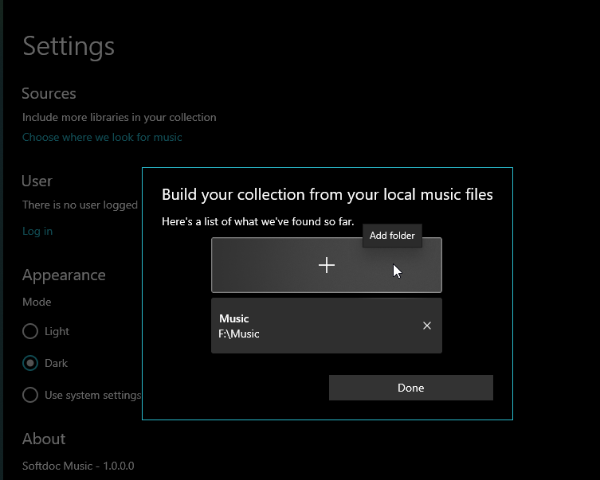  | [ChooseFolderDialogViewModel.cs](src/SoftdocMusicPlayer/ViewModels/ChooseFolderDialogViewModel.cs) |
| [Connected animations](https://docs.microsoft.com/en-us/windows/uwp/style/connected-animation)                                                                                                                                                    | Connected page animation usage         |                              [AlbumsView.xaml.cs](src/SoftdocMusicPlayer/Views/AlbumsView.xaml.cs) |
| [Coordinated animations](https://docs.microsoft.com/en-us/windows/uwp/style/connected-animation)                                                                                                                                                  | Used in connected transitions between pages                                                                                  |              [DetailedAlbumsView.xaml.cs](src/SoftdocMusicPlayer/Views/DetailedAlbumsView.xaml.cs) |
| [Context menus with icons](https://docs.microsoft.com/en-us/windows/uwp/controls-and-patterns/menus)                                                                                                                                              | Context menus with icons   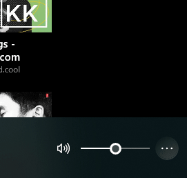                        |                                      [ShellView.xaml](src/SoftdocMusicPlayer/Views/ShellView.xaml) |
| Data Sorting                                                                                                                                                                                                                                      | Sort music   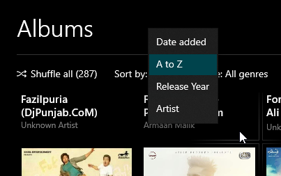                                        |                                [SortingHelper.cs](src/SoftdocMusicPlayer/Helpers/SortingHelper.cs) |
| [ColorThief](https://github.com/KSemenenko/ColorThief)                                                                                                                                                                                            | Base controls changes colors dynamically   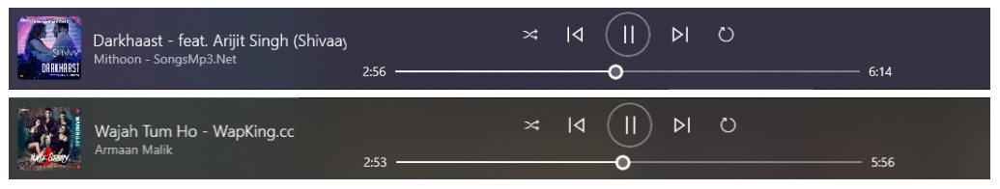      |                           [MediaViewModel.cs](src/SoftdocMusicPlayer/ViewModels/MediaViewModel.cs) |
| [Composition expression language](https://docs.microsoft.com/en-us/windows/uwp/composition/input-driven-animations)                                                                                                                               | Input-driven animation usage            |              [DetailedAlbumsView.xaml.cs](src/SoftdocMusicPlayer/Views/DetailedAlbumsView.xaml.cs) |
| [Implicit animations](https://docs.microsoft.com/en-us/windows/uwp/composition/using-the-visual-layer-with-xaml)                                                                                                                                  | More info on DetailedAlbums fade out when window starts scrolling                                                            |              [DetailedAlbumsView.xaml.cs](src/SoftdocMusicPlayer/Views/DetailedAlbumsView.xaml.cs) |
| [Full screen mode](https://docs.microsoft.com/en-us/uwp/api/Windows.UI.ViewManagement.ApplicationView#Methods_)                                                                                                                                   | Full screen mode for app   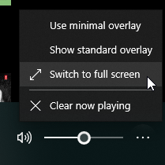                       |                                [ShellView.xaml.cs](src/SoftdocMusicPlayer/Views/ShellView.xaml.cs) |
| [Interaction tracker](https://docs.microsoft.com/en-us/uwp/api/windows.ui.composition.interactions.interactiontracker)                                                                                                                            | Timeline tracker   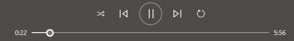                    |                                [ShellView.xaml.cs](src/SoftdocMusicPlayer/Views/ShellView.xaml.cs) |
| [NavigationView](https://docs.microsoft.com/en-us/windows/uwp/controls-and-patterns/navigationview)                                                                                                                                               | NavigationView usage   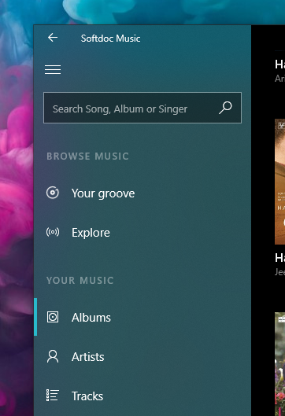                         |                                             [Shell.xaml](src/SoftdocMusicPlayer/Styles/Shell.xaml) |
| [Reveal highlight](https://docs.microsoft.com/en-us/windows/uwp/style/reveal)                                                                                                                                                                     | Reveal highlight usage                       |                   [CustomXamlControls.xaml](src/SoftdocMusicPlayer/Styles/CustomXamlControls.xaml) |
| [Media Transport Controls](https://docs.microsoft.com/en-us/windows/uwp/audio-video-camera/system-media-transport-controls)                                                                                                                       | System Media Transport Controls   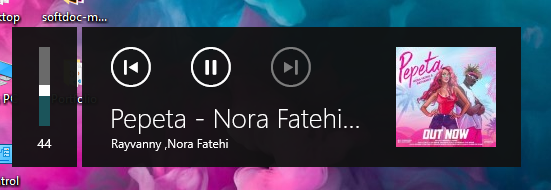                  |                           [MediaViewModel.cs](src/SoftdocMusicPlayer/ViewModels/MediaViewModel.cs) |
| [Template studio](https://blogs.windows.com/buildingapps/2017/05/16/announcing-windows-template-studio/)                                                                                                                                          | Settings model   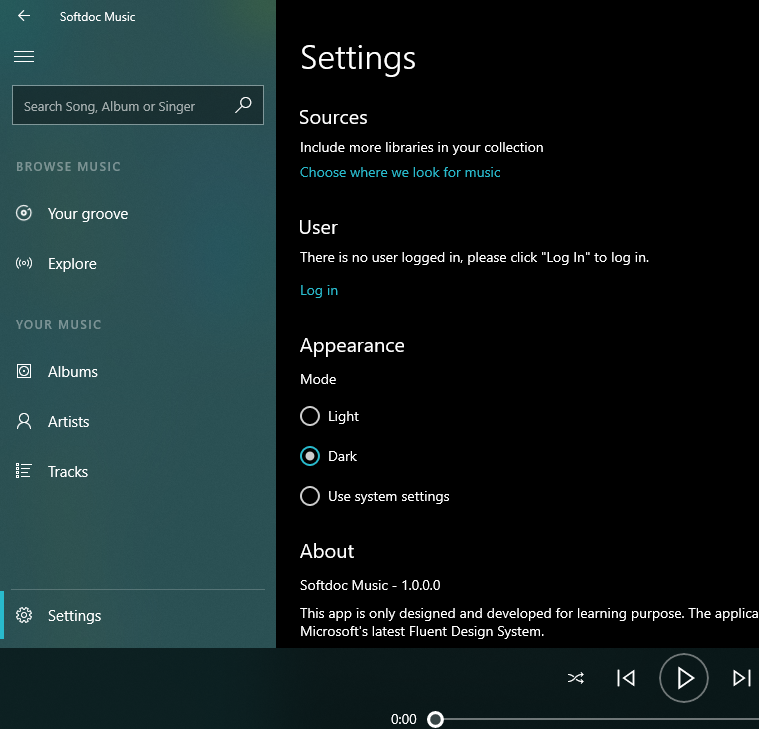                                           |                                [SettingsView.xaml](src/SoftdocMusicPlayer/Views/SettingsView.xaml) |
| [Template studio](https://blogs.windows.com/buildingapps/2017/05/16/announcing-windows-template-studio/)                                                                                                                                          | Theming model   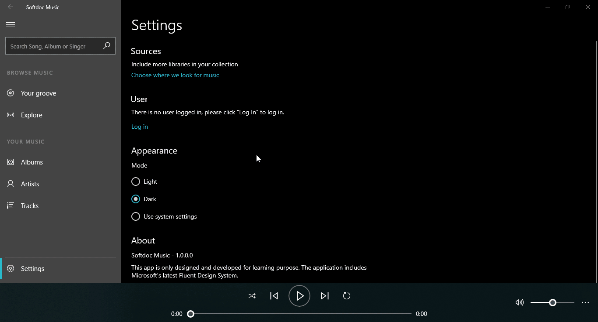                               |                 [ThemeSelectorService.cs](src/SoftdocMusicPlayer/Services/ThemeSelectorService.cs) |
| [Template studio](https://blogs.windows.com/buildingapps/2017/05/16/announcing-windows-template-studio/)                                                                                                                                          | User login model  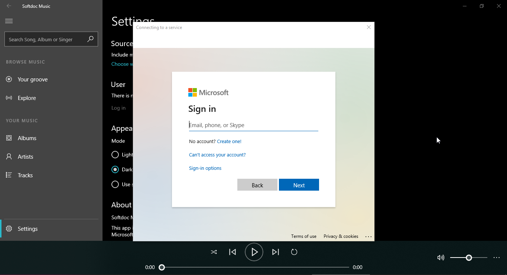                                       |                     [SettingsViewModel.cs](src/SoftdocMusicPlayer/ViewModels/SettingsViewModel.cs) |

## Reporting issues

### Known Issues

- A number of warnings have not been addressed
- Things that didn't make it from the design:
  - Artists detailed page
  - Search bar
  - Your groove and Explore section: this will come in a future update to the app

## System requirements

- Windows 10

### Prepare your environment

This sample requires Visual Studio and the Windows 10 Software Development Kit (SDK) version 1809, Windows 10 OS - October 2018 Update.

- [Get a copy of Visual Studio with support for building Universal Windows apps](https://www.visualstudio.com/downloads/) [includes SDK 1809]

- [Get the latest Windows 10 - October 2018 Update](https://www.microsoft.com/en-us/windows) [10.0.17763 or later]

- [Get the Windows 10 Insider SDK 1809](https://developer.microsoft.com/en-US/windows/downloads/windows-10-sdk) as a standalone download.

Additionally, to receive the latest updates to Windows and the development tools, and to help shape their development, join the [Windows Insider Program](https://insider.windows.com/ 'Become a Windows Insider').

## Build the sample

1. If you download the sample, be sure to unzip the entire archive, not just the folder you want to build.
2. Start Microsoft Visual Studio and select **File > Open > Project/Solution**.
3. Starting in the folder where you unzipped the sample, go to the src subfolder. Double-click the Visual Studio Solution (.sln) file.
4. Press Ctrl+Shift+B, or select **Build > Build Solution**.

## Run the sample

After opening the Visual Studio solution, set your startup project as **SoftdocMusicPlayer**, the architecture to x64 or x86. The next steps depend on whether you just want to deploy the sample or you want to both deploy and run it.

### Deploying the sample

Select **Build > Deploy Solution**.

### Deploying and running the sample

To debug the sample and then run it, press F5 or select **Debug > Start Debugging**. To run the sample without debugging, press Ctrl+F5 or select **Debug > Start Without Debugging**.

## Resources

- [Create a certificate for package signing](https://docs.microsoft.com/en-us/windows/msix/package/create-certificate-package-signing)
- [Fluent Design System](https://docs.microsoft.com/en-us/windows/apps/fluent-design-system)
- [Design and UI](https://docs.microsoft.com/en-us/windows/uwp/design/)

## Contributing

While I expect to at a later date, this project is not currently accepting contributions. For now, if you have any feedback or questions, please open an Issue on GitHub.

Contact at [kundan124@hotmail.com](mailto:kundan124@hotmail.com) with any additional questions or comments.

Copyright &copy; Kundan Gupta. All rights reserved.
This program/project is and its use is subject to the [MIT License](LICENSE)
